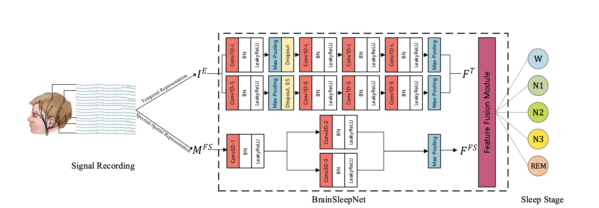

# BrainSleepNet

BrainSleepNet: Learning Multivariate EEG Representation for Automatic Sleep Staging



BrainSleepNet is designed to capture the comprehensive features of multivariant EEG signals for automatic sleep staging. The BrainSleepNet consists of an EEG temporal feature extraction module and an EEG spectral-spatial feature extraction module for the temporal-spectral-spatial representation of EEG signals.

These are the source code of BrainPrintNet.

# Dataset

 We evaluate our model on the [Montreal Archive of Sleep Studies (MASS) ](http://massdb.herokuapp.com/en/)dataset Subset-3. The MASS is an open-access and collaborative database of laboratory-based polysomnography (PSG) recordings.

# Requirements

- Python 3.6.5
- CUDA 9.0
- CuDNN 7.5.1
- numpy==1.15.0
- sklearn==0.19.1
- tensorflow_gpu==1.8.0
- Keras==2.2.0
- matplotlib==3.0.3

# Usage

- Preprocess

  - Prepare data (raw signals) in `data_dir`
    - Files name: 01-03-00**XX**-Data.npy, where **XX** denotes subject ID.
    - Tensor shape: **[sample, channel=26, length]**, where channel 0 is ECG channel, 1-20 are EEG channels, 21-23 are EMG channels, 24-25 are EOG channels.
  - Modify directory
    - Modify `data_dir` and `label_dir`  in `run_preprocess.py` accordingly.
    - (Optional) Modify `output_dir` in  `run_preprocess.py`.
  - Run
    - `cd preprocess`
    - `python run_preprocess.py`
- Command Line Parameters

  - Training
    - `--batch_size`: Training batch size.
    - `--epoch`: Number of training epochs.
    - `--num_fold`: Number of folds.
    - `--save_model`: Save the best model or not.
  - Directory
    - `--model_dir`: The directory for saving best models of each fold.
    - `--data_dir1`: The directory of the EEG signals.
    - `--data_dir2`: The directory of the spectral-spatial representation of EEG signals.
    - `--result_dir`:  The directory for saving results.
- Input Data Shape

  - EEG_EOG
    - Data**SubID**.npy : (numOfSamples, numOfChannels, timeLength) -> (numOfSamples, 6 + 2, 30 * 128 * 3)
      - numOFChannels: 6 channels EEG signals and 2 channels EOG signals.
      - timeLength: 30 (s) * 128 (Hz) * 3 (epochs) = 11520
    - Label**SubID**.npy: (numOfSamples, )
  - EMG
    - Data**SubID**.npy : (numOfSamples, numOfChannels, timeLength) -> (numOfSamples, 3, 11520)
      - numOFChannels: 3 channels EMG signals.
      - timeLength: 30 (s) * 128 (Hz) * 3 (epochs) = 11520
    - Label**SubID**.npy: (numOfSamples, )
  - fre_spa
    - Data**SubID**.npy : (numOfSamples, numOfFreqBands, height, width, 1) -> (numOfSamples, 5, 16, 16, 1)
      - numOfFreqBands: 5 frequency bands ($\delta, \theta, \alpha, \beta, \gamma$)
      - height, width: 16 px $\times$ 16 px
    - Label**SubID**.npy: (numOfSamples, )
- Training

  Run `run.py` with the command line parameters. By default, the model can be run with the following command:

  ```
  CUDA_VISIBLE_DEVICES=0 python run.py
  ```
